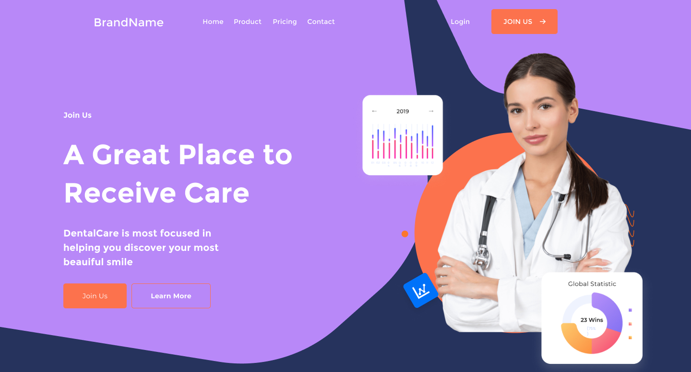

<h1 align="center">
  
   
  Medical Thrive Landing
   
</h1>
<h4 align="center">Showdown of Next.JS usage with CPE</h4>

  <a href="https://www.figma.com/file/VBJvJjqhm4QjMYrQnnXeSj/Medical-Thrive---simple-website%C2%A0template%C2%A0download-html-with%C2%A0css-for-medical-(Community)?type=design&t=PwVTgLqExichw3Ke-6" target="_blank">Figma</a>

